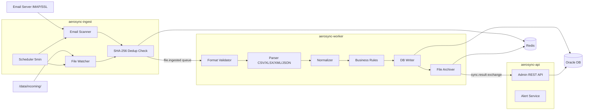

# VATM AeroSync — Module Plans (UC1)

Automated data sync from email and file storage into Oracle DB, with a dashboard REST API for admin monitoring. All modules follow **TDD** (Red → Green → Refactor) for non-trivial components.

---

## Why 4 Modules (not 3)

The original split was **ingest / worker / dashboard**. All three need the same JPA entities, DTOs, repositories, and exceptions. Adding **`aerosync-common`** as a shared jar avoids duplication and circular dependencies.

```
aerosync-parent/              ← root pom.xml (BOM, no code)
├── aerosync-common/          ← shared jar (entities, repos, DTOs)     [DONE]
├── aerosync-ingest/          ← Spring Boot app (scanner + ingestion)
├── aerosync-worker/          ← Spring Boot app (processing pipeline)
└── aerosync-api/             ← Spring Boot app (dashboard REST API)
```

---

## UC1 Summary

| Area | Detail |
|------|--------|
| **Actors** | Scheduler, Email Server (IMAP/SSL), File System, Admin, Operator |
| **Main flow** | Scan email + `/data/incoming/` → validate → parse → business rules → Oracle → archive → audit log → dashboard notification |
| **Alternate flows** | ALT-01 format error → `/error/`; ALT-02 business rule → `/quarantine/` + rollback; ALT-03 duplicate hash → skip; ALT-04 DB retry 2→4→8 min; ALT-05 email unavailable; ALT-06 no attachment |
| **Business rules** | BR-01 idempotency (SHA-256); BR-02 atomic batch; BR-03 retention (60/90 days); BR-04 security; BR-05 URGENT/VIP priority; BR-06 max 100 files/cycle; BR-07 100% audit |

---

## Data Flow



---

## RabbitMQ Topology

| Exchange / Queue | Type | Consumer | Notes |
|------------------|------|----------|-------|
| `file.ingested` | direct | — | Ingest publishes here |
| `file.processing.queue` | queue | worker | Priority queue (BR-05 URGENT/VIP) |
| `file.ingested.dlq` | DLQ | — | After retries exhausted |
| `sync.result` | fanout | — | Worker publishes results |
| `dashboard.alerts.queue` | queue | api | Dashboard alerts |

Worker retry (ALT-04): exponential backoff 2 → 4 → 8 minutes (configured in `application.yaml`).

---

# Module 1: `aerosync-common`

**Status:** Implemented — 21 tests passing, `mvn package -pl aerosync-common` succeeds.

**Type:** Shared `jar` — no Spring Boot main class. Build first; all other modules depend on this.

### Responsibilities

- Shared domain model, repositories, messaging DTOs, enums, exceptions, config properties.

### Dependencies

- `spring-boot-starter-data-jpa`
- `ojdbc11` (runtime)
- `jackson-databind`, `jackson-datatype-jsr310`
- `spring-boot-starter-test`, `spring-boot-starter-data-jpa-test`, `h2` (test)

### Deliverables

| Package | Contents |
|---------|----------|
| `enums` | `SyncStatus`, `FileSourceType`, `AlertLevel`, `FileType` |
| `exception` | `FormatValidationException`, `BusinessRuleException`, `DuplicateFileException` |
| `config` | `FilePathProperties` (`app.file-paths`) |
| `entity` | `SyncJob`, `FileRecord`, `AuditLog`, `EmailMetadata` |
| `repository` | `SyncJobRepository`, `FileRecordRepository`, `AuditLogRepository`, `EmailMetadataRepository` |
| `dto` | `FileIngestedEvent`, `SyncResultEvent` |

### TDD Build Order

1. **Enums** — no tests (pure value types).
2. **Exceptions** — `ExceptionTest` first, then implementations.
3. **Config** — `FilePathPropertiesTest` with `@EnableConfigurationProperties`, then `FilePathProperties`.
4. **Entities** — `@DataJpaTest` + H2 for each entity, then JPA classes (`@PrePersist`, unique constraints on `fileHash` / `messageId`).
5. **Repositories** — `@DataJpaTest` for query methods, then Spring Data interfaces.
6. **DTOs** — Jackson round-trip tests, then event POJOs.

### Definition of Done

- [x] All `@DataJpaTest` tests pass with H2
- [x] All unit tests pass
- [x] `mvn package -pl aerosync-common` produces jar (no main class)
- [x] No linter warnings on module sources

---

# Module 2: `aerosync-ingest`

**Status:** Implemented — 22 tests passing, `mvn package -pl aerosync-ingest` succeeds.

**Type:** Spring Boot application.

**UC1 steps:** 1–3 — periodic scan, detect new files, save email metadata, SHA-256 dedup, publish to RabbitMQ.

### Responsibilities

| Component | Description |
|-----------|-------------|
| `IngestScheduler` | `@Scheduled(fixedDelay = 300_000)` (5 min); triggers scanners; max **100 files/cycle** (BR-06) |
| `EmailIngestService` | IMAP/SSL (JavaMail); whitelist sender; download attachments; ALT-06 no attachment |
| `FileSystemIngestService` | Watch `app.file-paths.incoming` (e.g. `/data/incoming/`) |
| `DeduplicationService` | SHA-256; Redis lookup; ALT-03 / BR-01 → `SKIPPED_DUPLICATE` |
| `IngestPublisher` | Publish `FileIngestedEvent` to `file.ingested`; priority for URGENT/VIP (BR-05) |
| Email metadata | Persist via `EmailMetadataRepository` (from common) |

### Dependencies

- `aerosync-common`
- `spring-boot-starter-amqp`
- `spring-boot-starter-data-redis`
- `jakarta.mail` (JavaMail)
- `spring-boot-starter-test`, Testcontainers (optional)

### ALT-05

Track consecutive email server failures in Redis; alert after 3 consecutive failures.

### TDD Build Order

| Test class | Covers |
|------------|--------|
| `IngestSchedulerTest` | Rate limit 100 files/cycle; triggers both scanners |
| `FileSystemIngestServiceTest` | New files only; paths from `FilePathProperties` |
| `EmailIngestServiceTest` | Whitelist; attachments; NO_ATTACHMENT (ALT-06) |
| `DeduplicationServiceTest` | SHA-256; Redis mock; duplicate → skip |
| `IngestPublisherTest` | JSON event; exchange/routing; priority flag |
| Integration | `@SpringBootTest` + Testcontainers RabbitMQ/Redis |

### Definition of Done

- [x] Module in root parent `pom.xml`
- [x] Scheduler runs and respects BR-06
- [x] New files published as `FileIngestedEvent` after dedup
- [x] Email ingest + metadata persisted
- [x] All tests green

---

# Module 3: `aerosync-worker`

**Status:** Implemented — 23 tests passing, `mvn package -pl aerosync-worker` succeeds.

**Type:** Spring Boot application (existing module, refactor to use `aerosync-common`).

**UC1 steps:** 4–8 — validate, parse, normalize, business rules, DB write, archive, audit.

### Responsibilities

| Component | Description |
|-----------|-------------|
| `FileProcessingConsumer` | `@RabbitListener` on `file.processing.queue`; ALT-04 retry (2→4→8 min) |
| `FormatValidatorStep` | Extension, UTF-8, schema, size → ALT-01 `/error/` |
| `ParserStep` | Strategy: CSV / XLSX / XML / JSON |
| `NormalizerStep` | Trim, uppercase, timezone |
| `BusinessRuleValidatorStep` | Callsign, From, To, DateFlight → ALT-02 `/quarantine/` + rollback |
| `DatabaseWriterStep` | `@Transactional` Oracle; BR-02 full rollback on failure |
| `FileArchiverStep` | Move to `/processed/` as `SLB_YYYYMMDD_HHMMSS_<source>_<name>.ext` |
| `AuditLogService` | BR-07 write-once audit (who/when/what/result/duration) |
| `RetentionCleanupJob` | BR-03: processed 60d; error & quarantine 90d |
| Redis | Distributed lock per file (multi-instance safety) |

### Dependencies

- `aerosync-common`
- `spring-boot-starter-amqp`
- `spring-boot-starter-data-redis`
- Apache POI (XLSX)
- Jackson (JSON/CSV)
- Existing: JPA, Oracle, Web (optional for health)

### TDD Build Order

| Test class | Covers |
|------------|--------|
| `FormatValidatorStepTest` | Valid/invalid extension, encoding, schema |
| `ParserStepTest` | Sample files per `FileType` |
| `NormalizerStepTest` | Trim, uppercase, timezone |
| `BusinessRuleValidatorStepTest` | Each field rule; quarantine path |
| `DatabaseWriterStepTest` | Success + rollback (`@DataJpaTest` or Testcontainers Oracle) |
| `FileArchiverStepTest` | Naming convention; `/error/`, `/quarantine/`, `/processed/` |
| `AuditLogServiceTest` | Required fields persisted |
| `FileProcessingConsumerTest` | End-to-end message handling (mock steps) |
| Integration | Testcontainers: Oracle, RabbitMQ, Redis |

### Definition of Done

- [x] Depends on `aerosync-common`
- [x] Consumes `file.processing.queue`
- [x] Full pipeline with all ALT paths
- [x] Publishes `SyncResultEvent` to `sync.result`
- [x] Retention job scheduled
- [x] All tests green

---

# Module 4: `aerosync-api`

**Status:** Implemented — 13 tests passing, `mvn package -pl aerosync-api` succeeds.

**Type:** Spring Boot application (dashboard backend).

**UC1 step:** 9 — notifications and admin visibility; postconditions (alerts on errors).

### Responsibilities

| Component | Endpoints / behavior |
|-----------|----------------------|
| `DashboardController` | `GET /api/dashboard/stats` — counts by status, cycle stats |
| `SyncJobController` | `GET /api/jobs`, `GET /api/jobs/{id}`, `POST /api/jobs/{id}/retry` |
| `AuditLogController` | `GET /api/audit-logs` — filter by date, status, source |
| `ConfigController` | `GET/PUT /api/config` — scheduler interval, whitelist, rate limit |
| `AlertService` | Consume `sync.result` → expose/store ALT-04/ALT-05 alerts |

### Dependencies

- `aerosync-common`
- `spring-boot-starter-webmvc`
- `spring-boot-starter-amqp`
- `spring-boot-starter-data-jpa` (read-only queries)

### TDD Build Order

| Test class | Covers |
|------------|--------|
| `DashboardControllerTest` | Stats aggregation (`MockMvc`) |
| `SyncJobControllerTest` | List, detail, retry triggers republish |
| `AuditLogControllerTest` | Date range and status filters |
| `ConfigControllerTest` | GET/PUT validation |
| `AlertServiceTest` | Consumes `SyncResultEvent`; CRITICAL/WARNING handling |
| Integration | `@SpringBootTest` + Testcontainers |

### Definition of Done

- [x] Module in root parent `pom.xml`
- [ ] REST API documented (OpenAPI optional)
- [x] Reads Oracle via common repositories
- [x] Consumes `dashboard.alerts.queue`
- [x] All tests green

---

## Cross-Module Migration Checklist

1. [x] Root `pom.xml` parent BOM
2. [x] `aerosync-common` module
3. [x] `aerosync-worker` inherits parent
4. [x] Add `aerosync-ingest` to parent `<modules>`; [x] `aerosync-api`
5. [x] Add `aerosync-common` dependency to ingest, worker, api
6. [x] Configure RabbitMQ topology in ingest + worker + api
7. [x] Align `application.yaml` per app (ports, queues, Redis)

---

## Infrastructure (local)

From `docker-compose.yml`:

| Service | Port | Use |
|---------|------|-----|
| Oracle XE | 1521 | Central DB |
| RabbitMQ | 5672 / 15672 | Messaging |
| Redis | 6379 | Dedup, locks, email failure counter |

File paths (worker/common config): `incoming`, `processed`, `error`, `quarantine` under `C:/vatm-storage/...`.

---

## Suggested Implementation Order

1. **aerosync-common** — done  
2. **aerosync-ingest** — produces queue messages  
3. **aerosync-worker** — done  
4. **aerosync-api** — observability and admin  
5. **RabbitMQ wiring** — verify end-to-end across all three apps  

---

*Generated from UC1 use case and AeroSync multi-module design. Module 1 completed 2026-06-03; Module 2–3 completed 2026-06-04; Module 4 completed 2026-06-04.*
